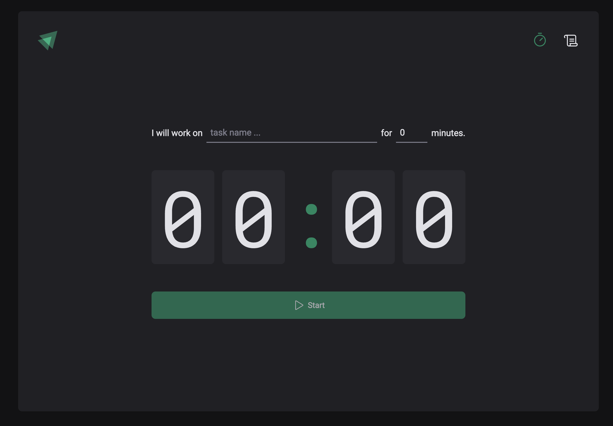
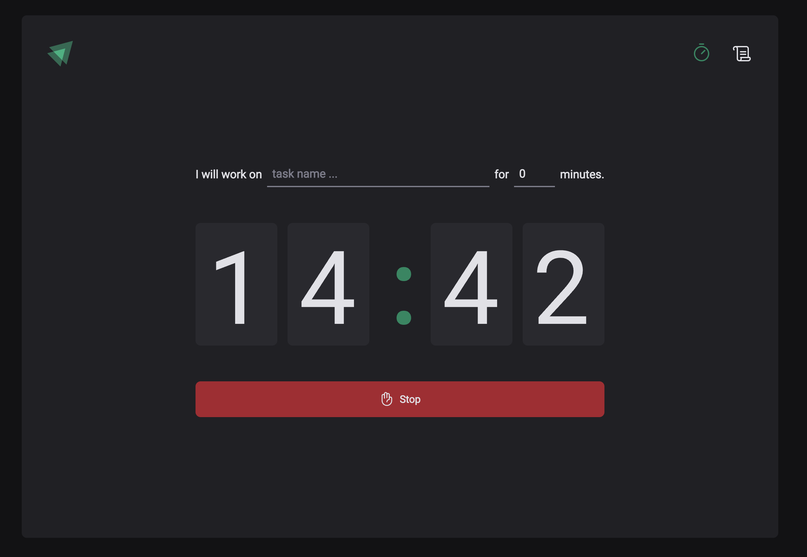
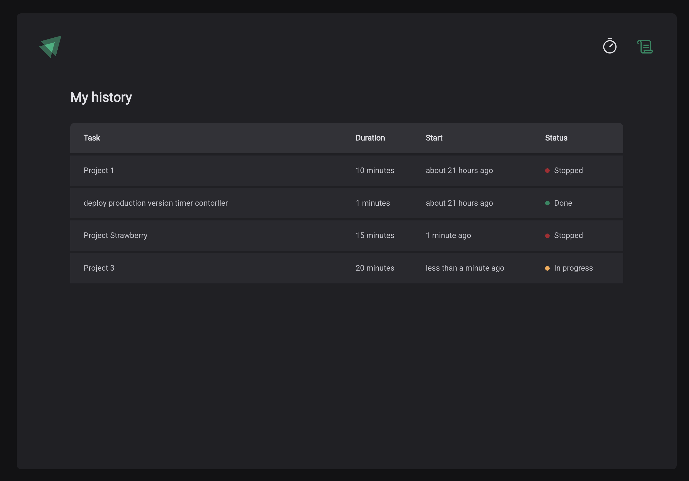

# Task Timer Application

## Overview

The Task Timer Application is a minimalistic and intuitive productivity tool designed to help users track their work sessions. The app allows users to set a timer for a specific task, start and stop the countdown, and review their work history to track progress over time.

## Features

- **Task-based Time Tracking**: Enter the task name and specify the duration for focused work.
- **Countdown Timer**: A digital timer that visually represents the remaining time.
- **Start/Stop Functionality**: Users can start and stop the timer at any point.
- **Task History Tracking**: Keeps a log of completed and in-progress tasks with timestamps and statuses.
- **Dark Mode UI**: A sleek, modern, and minimalistic interface optimized for comfortable viewing.

## Screenshots

### Timer Setup

### Active Timer

### Task History

## Installation

To run the application locally, follow these steps:

## Usage

1. Enter the task name and duration.
2. Click the **Start** button to begin the timer.
3. The countdown timer will run until completion or until stopped manually.
4. Completed and stopped tasks will be recorded in the **Task History** section.

## Technologies Used

- **TypeScript** – For type-safe development.
- **Vite** – For fast development and optimized builds.
- **React.js** – For building the interactive UI.
- **Node.js** – Backend for data handling (if applicable).
- **Styled Components** – For UI design.
